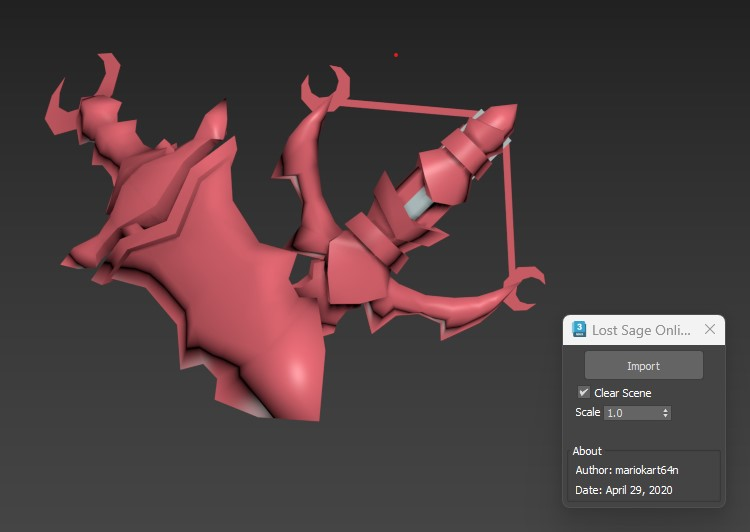

# Lost Saga Online Import Script for 3ds Max

## Overview

This MaxScript allows users to import 3D models from the Lost Saga Online game, specifically from `.msh` files. The script reads model data such as vertex positions, normals, UV coordinates, and face indices, allowing for basic model visualization in 3ds Max.

### Features
- Import `.msh` model files.
- Clear the current scene before import (optional).
- Adjustable scale for imported models.
- User-friendly interface for selecting files and configuring options.

### Limitations
- **No Material Support:** Currently, the script does not support materials, as they were not provided in the sample files.
- **Bone Weighting:** While the script can read bone information, it does not implement any skinning or bone weight functionality.

### Usage
1. Open 3ds Max.
2. Load the MaxScript by running it.
3. Click the "Import" button to select a `.msh` file.
4. Optionally check the "Clear Scene" box to remove existing objects before import.
5. Adjust the scale if necessary using the spinner.
6. Press "OK" to import the model.
